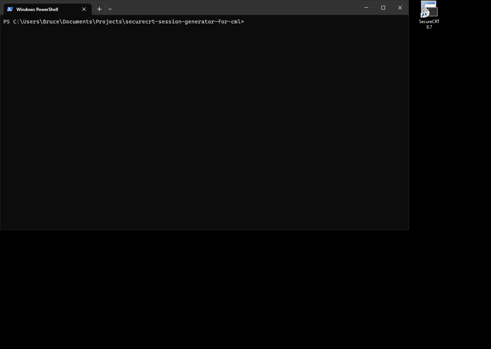

# SecureCRT Session Generator for Cisco Modeling Labs (CML) 

## Introduction

The method of console access to lab devices baked into CML is less than ideal for fast, efficient navigation between device consoles.

The purpose of this project is to make console access to devices in CML more convenient by allowing users to automate the creation of SecureCRT session files. It leverages CML's built-in `console server` (not the breakout tool).

Each session file will be named to match its associated device/node name in the lab and will display that name in the tab in SecureCRT when the session is used.

## Demo

## Screenshots

## Requirements

- Windows 10 (possibly 11)
- Python 3
- SecureCRT 8.7.2 or later
- CML 2.2.2 or later

## Installation
- Internet connectivity required.
- Recommend using **venv**.
- The source directory (_securecrt-session-generator-for-cml_) can be placed anywhere. It can be renamed if desired.

### Scripted Method
- Execute **install.bat** from within the source directory.
- **install.bat** will instantiate a virtual environment within the source directory and download/install all necessary Python packages within the environment.

### Manual Method
- Open a terminal.
- Navigate to the source directory. 
- Execute the following command to create the virtual environment:

        python3 -m venv venv

- Activate the virtual environment:

        source venv/bin/activate

- Install the necessary Python packages for the virtual environment:

        pip3 install -r requirements.txt

- Deactivate the virtual environment:

        deactivate

## Usage

### Scripted Method
- Execute the **crt_session_generator.bat** from the source directory or via a shortcut to it.
- Follow the prompts in the terminal.

### Manual Method
- Open a command prompt/PowerShell session.
- Navigate to the source directory. Execute the following command:

        .\venv\Scripts\python.exe session_gen.py

- Follow the prompts in the terminal

### Notes
- Neither I nor this project is associated with Cisco Systems, Inc. or VanDyke Software in any way.
- Credentials and CML IP/hostname are stored in cleartext in config.yaml. This was orignally meant to mimic how the Breakout Tool operates.
- Deleting **config.yaml** will allow the user to re-enter CML credentials and host information the next time the script is executed.
- The password stored in the session files are encrypted by SecureCRT if setup was follwed as instructed.
- This tool only needs to be run to generate sessions for existing labs, new labs, changes (additions, removals, renamings) to devices in existing labs for which sessions have already been created, or if a lab has been renamed that has had sessions generated.
- This tool does not need to be running in order for console sessions to function.
