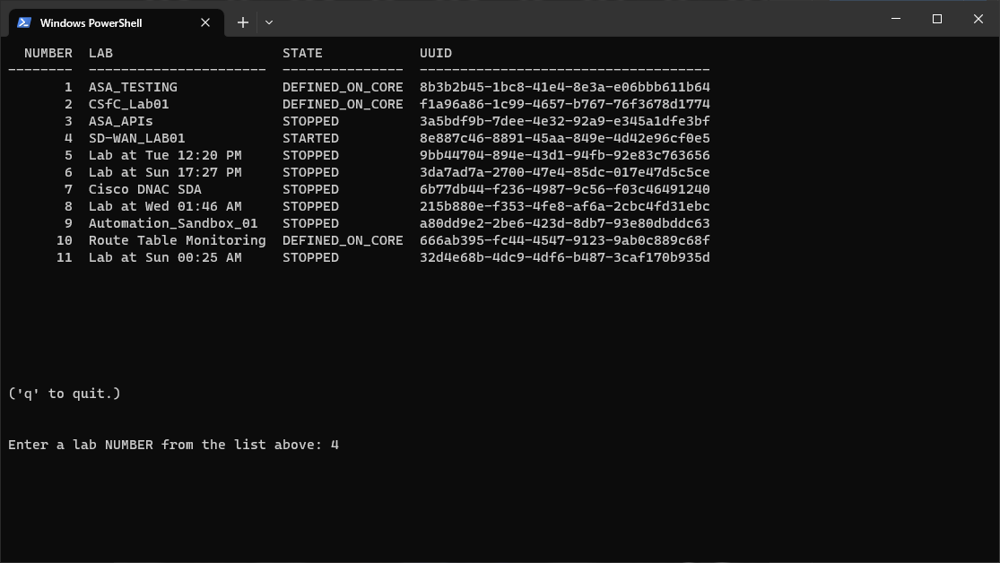
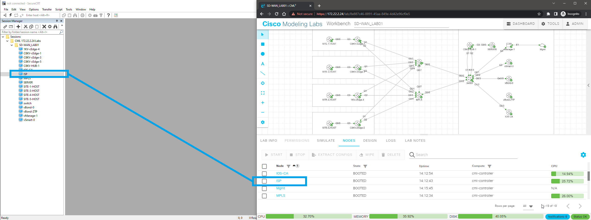
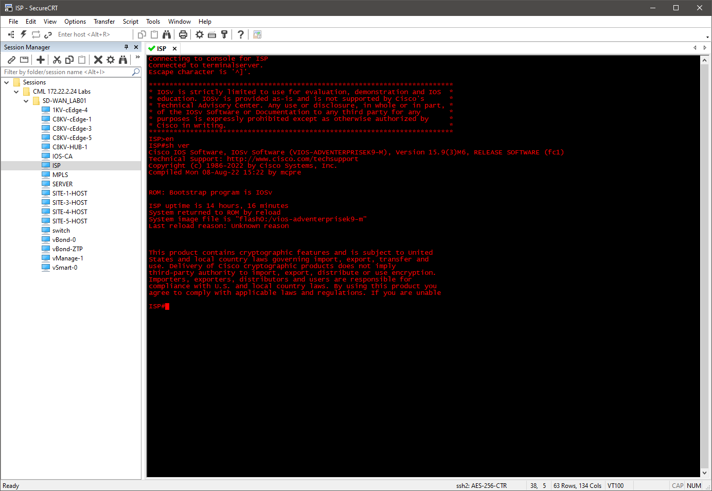

# SecureCRT Session Generator for CML

Python 3.10.1

## Introduction

The method of console access to lab devices baked into CML is not very conducive to fast, efficient navigation between device consoles.

The purpose of this project is to make console access to devices in CML more convenient by allowing users to automate the creation of SecureCRT session files. It leverages CML's built-in `console server` (not the breakout tool).

Newly created sessions will be organized in the SecureCRT "Sessions" directory as:

CML [ip_address_or_hostname] Labs\\[lab_name]\\[device_name]

## Screenshots

## Requirements

- Windows 10 (possibly 11)

- SecureCRT 8.7.2 or later

## Installation
- Internet connectivity required.
- Recommend using a virtual environment.
- The source directory (SecureCRT_Session_Generator_For_CML) can be placed anywhere (it can be renamed if desired).

### Scripted Method
- Execute install.bat from within the source directory. It will instantiate a virtual environment within the same directory and download/install all necessary Python packages.

### Manual Method
- Open a command prompt/PowerShell session.
- Navigate to the source directory. 
- Execute the following command to create the virtual environment:

        python -m venv venv

- Activate the virtual environment:

        .\venv\Scripts\activate.bat

- Install the necessary Python packages for the virtual environment:

        pip install -r requirements.txt

## Usage

### Scripted Method
- Execute the crt_session_generator.bat from the source directory or via a shortcut to it.
- Follow the prompts in the terminal.

### Manual Method
- Open a command prompt/PowerShell session.
- Navigate to the source directory. Execute the following command:

        .\venv\Scripts\python.exe session_gen.py

- Follow the prompts in the terminal

### Notes
- Credentials and CML IP/hostname are stored in cleartext in config.yaml.
- Deleting config.yaml will allow the user to re-enter CML credentials and host information the next time the script is executed.
- The password stored in the session files are encrypted by SecureCRT.
- This tool only needs to be run to generate sessions for existing labs, new labs, changes (additions, removals, renamings) to devices in existing labs for which sessions have already been created, or if a lab has been renamed that has had sessions generated.
- This tool does not need to be running in order for console sessions to function.

## Compatibility

CML 2

## Licensing Info

